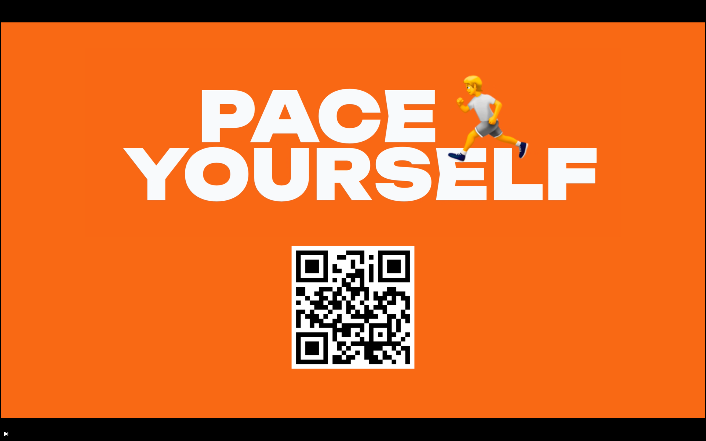

# PACE 🏃YOURSELF

---
### Screencast:

---
### About:
#### Problem:
Physical and mental health is declining — especially for young people.
However, exercise of the mind and body are proven to help.
One of the most accessible forms of exercise are walking and running.
But... it's not very fun. 🙈
Especially for young people, who crave a level of interactivity to get engaged.

#### Solution:
Based on research studies we found, music is proven to improve running performance. With our solution, we are trying to boost it even further and engage as many people as possible. We hope it can make their lives better.

#### Technical Details:
To make AI part we utilised Meta Demucs, a transformer-based music source separation technology, to split the song into its stems (vocals, bass, drums and other instruments). This combined with other post-processing results in a dynamic, truly unique, for every run, experience. User's favourite songs can be synchronised from their streaming service of choice. Through an agreement with the streaming service - this could be brought to production. We also used React.js for creation of UI and Web app, used Tone.js to work with Audio. We developed a component for getting real-time user activity based on DeviceMotion API.

---
### Demo Link
The app is available online and can be tested out by anyone at http://bit.ly/pace_yourself

---
### Also available for running locally:
#### Frontend:
- `cd frontend && npm install`
- `npm start` will open http://localhost:3000 in your default browser

---

### Team:
- [Vladimir Kiliazov](https://github.com/vladimirwest)

- [Frank Sandqvist](https://github.com/FrankSandqvist)

- [Vladislav Levitskii](https://github.com/mcvladthegoat)

- [Fedor Rogoznyy](https://github.com/frogoznyy)
